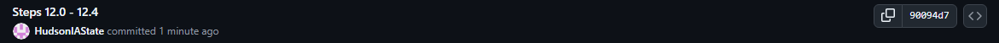

<!-- README.md is generated from README.Rmd. Please edit the README.Rmd file -->

```{r setup, include=FALSE}
knitr::opts_chunk$set(echo = TRUE)
```

# Lab report #1

Follow the instructions posted at <https://ds202-at-isu.github.io/labs.html> for the lab assignment. The work is meant to be finished during the lab time, but you have time until Monday evening to polish things.

Include your answers in this document (Rmd file). Make sure that it knits properly (into the md file). Upload both the Rmd and the md file to your repository.

All submissions to the github repo will be automatically uploaded for grading once the due date is passed. Submit a link to your repository on Canvas (only one submission per team) to signal to the instructors that you are done with your submission.

------------------------------------------------------------------------

Hudson: Running into issues with installing package "classdata" with "RTools is required..."

To Fix:

1.  Installed RTools44,

2.  ran install package for classdata

Hudson: Ran into issues with the PAT not working, but was able to work around it by signing into the pop-up using my browser.

Hudson: Connected to git, able to push and pull with remote origin \@ ds202lab-1-team-11. Continuing to follow Chapter 12 instructions

Hudson: I wish I had this class first semester!! Everyone always talks about "git" this, and "git" that.

Steps followed for Chapter 12:

12.1: checked prerequisites, made a local repo

12.2: created using gitclassroom link.

12.3: cloned online gitclassroom made in 12.2 to same directory created in 12.1

12.4: 'This is a line from RStudio'

12.5: Pushed first 4 steps, no issues arose.

12.6: 

12.7: Skipped cleanup part
